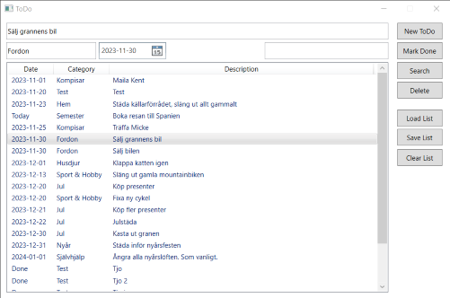

# Todo list

A simple application to manage to-do lists.

Features:
* Tasks contain title, due date, project, and status
* Supports creation, editing, searching, and removal of tasks
* To-do lists can be loaded and saved to disk

